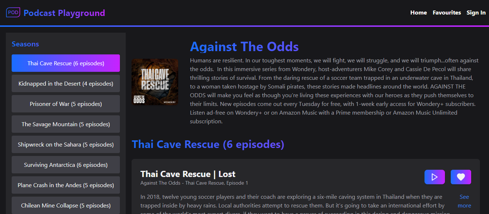

# Podcast Web App ✨

Welcome to our Podcast Web App project! This application allows users to discover and listen to podcasts across various genres. Built with React, TypeScript, and Next.js, it offers a seamless browsing and listening experience.



## Features

- **Podcast Discovery**: Explore podcasts by genres and popularity.
- **Episode Streaming**: Listen to episodes directly within the app.
- **Favorite Podcasts**: Save podcasts to your favorites list.
- **Responsive Design**: Enjoy a consistent experience across devices.

## Demo

Check out the live demo [here](https://lugvis-340-wfc-2401-group-a-lugan-visagie-djs-11.vercel.app/). Use the sign-in button to access the home page.
### NOTE: There is no Authentication so there is no need for a account or any details, just click the sign in button and it will take you to the home page.

## Getting Started

To run this project locally, follow these steps:

1. Clone the repository:

   ```bash
   git clone https://github.com/your-username/LUGVIS340_WFC2401_GroupA_LUGAN-VISAGIE_DJS11

- or download the zip file and unzip the folder(prefered)
- then open it in vs code
2. Navigate into the project directory:
    cd podcast-app
3. Install dependencies:
    npm install
4. Run the development server:
    npm run dev

## Tech stack
- Frontend: React, Next.js
- Styling: Tailwind CSS
- State Management: React Context API
- API Integration: Fetch API for podcast data

## Contact

For any questions, feedback, or collaboration inquiries, feel free to reach out:

- **Email**: (luganvisagie42@gmail.com)📧
- **LinkedIn**: (https://www.linkedin.com/in/lugan-visagie-ab3794268)💼
- **GitHub**: (https://github.com/Lugan2004)🔥

We appreciate your interest in our project and look forward to hearing from you!

